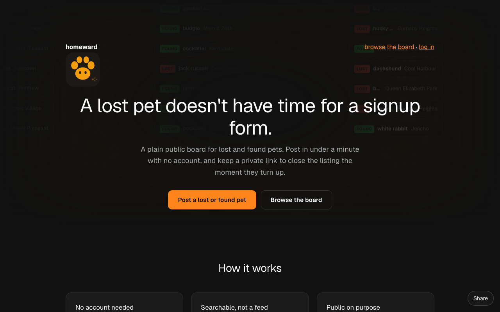
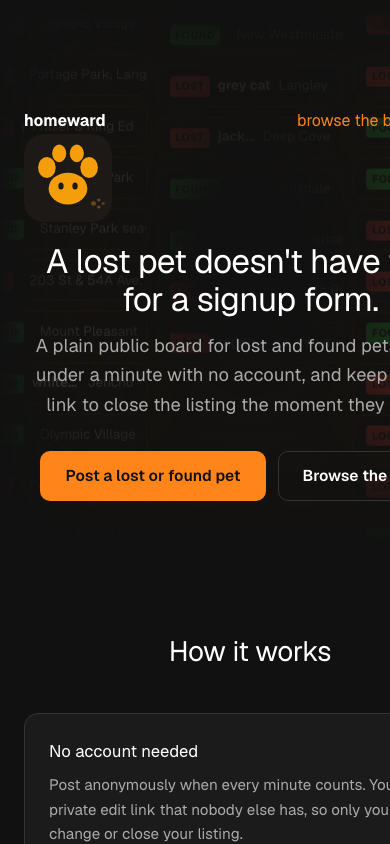

# Homeward

  [](https://github.com/nulljosh/homeward)

**Live:** https://homeward.heyitsmejosh.com

A pet goes missing. The neighbourhood should know in minutes, not days.

Homeward is a lost and found board for pets. Post a missing animal or one you've found, with a photo and where you last saw it. Everyone nearby sees it. Web, plus native apps for iOS, Android, macOS and Windows.

## Screenshots




## Features

- Post lost or found, with photo and location
- Browse what's near you
- Native apps from one Kotlin Multiplatform codebase in `kmp/`, SwiftUI in `ios/`
- Web on Cloudflare Pages

## Run

```sh
npm install && npm run dev
cd kmp && ./gradlew :composeApp:assembleDebug
```

## License

MIT 2026 Joshua Trommel

## Whitepaper

[Technical whitepaper](WHITEPAPER.md)
